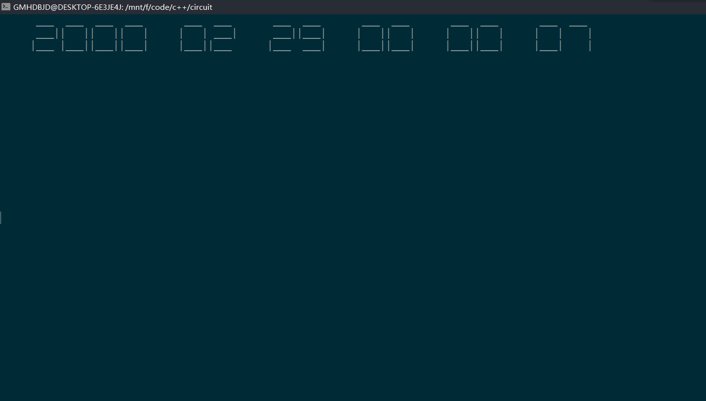

# Project -- Simple Circuit
A digital circuit using C++ for endterm project: 

1 - Environment:
   - run both on ubuntu and windows.(windows may be better)

2 - Compile :
   - just execute make (to compile) in the root directory.
   - execute ./circuit to run the circuit
  
3 - Circuit : 

- there two modes : 
    - combinatorial circuit :
      >  you should provide your input and the circuit will get the output.

    - sequential circuit :
      > use clk pulse input  automaticlly and seven-segment output. 

    you can input 'help' to view command in both mode.

4 - test :
- full_adder
- student_id
- clock

5 - module :
- 74LS48
- 74LS138
- counter
- JK-flipflop
- clk_transfer

#

